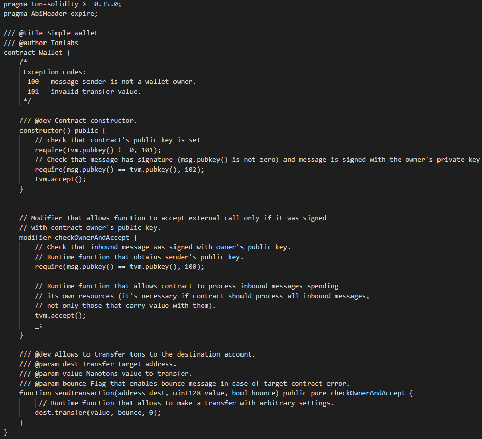
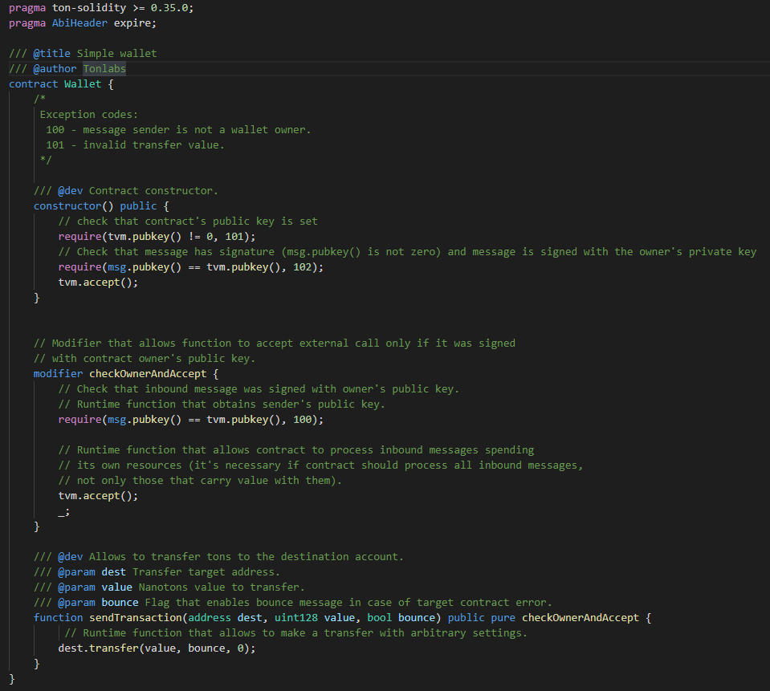
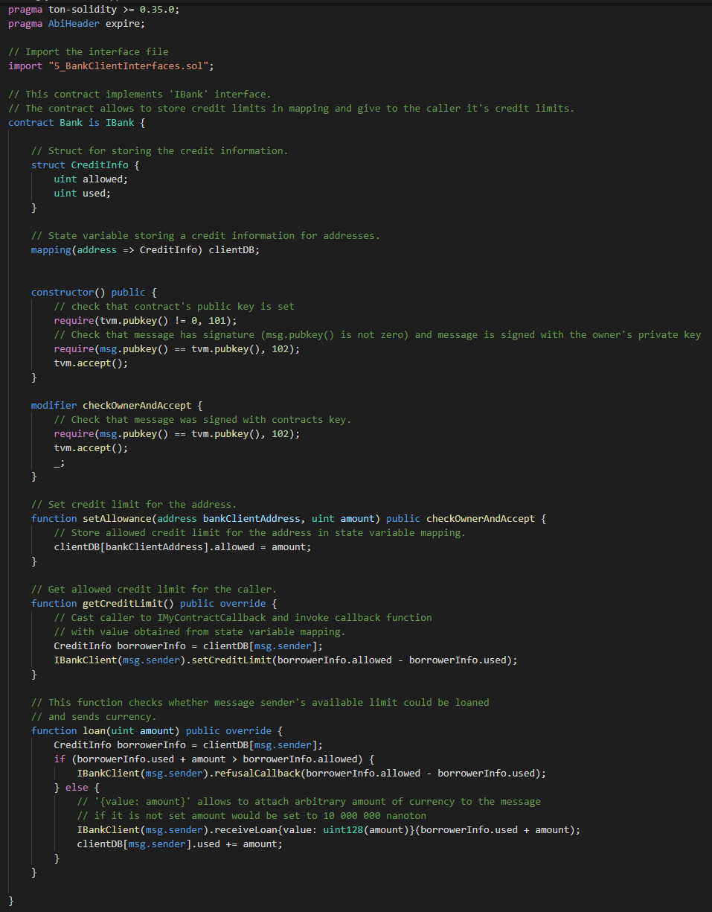

# Free TON Solidity support for Visual Studio Code
  

Free TON Solidity is the language used in Free TON to create smart contracts. 

This extension provides: 
* Syntax highlighting (keywords, variables, literals, comments and other things from the language specification and Free TON additions). 
* Code completion (keywords, variable names, classes names, method names, interfaces)
* Intellisense (commands, contracts, methods, interfaces)
* Extension is fully customizable by VS Code native settings. For example, for colors of syntax highlighting.

This extension is a fork of [vscode-solidity](https://github.com/juanfranblanco/vscode-solidity) optimized for Free TON Solidity. 

This extension was created as solution for ["Free TON Solidity support for Visual Studio code"](https://forum.freeton.org/t/contest-proposal-syntax-highlighting-for-solidify-source-code-files-written-for-free-ton/11300)  competition.

## Examples
### 10_Wallet.sol 
[Download](examples/10_Wallet.sol) or [Original](https://raw.githubusercontent.com/tonlabs/samples/master/solidity/10_Wallet.sol)
#### Without extension:

#### With extension:

### 5_Bank.sol
[Download](examples/5_Bank.sol) or [Original](https://raw.githubusercontent.com/tonlabs/samples/master/solidity/5_Bank.sol)

## Versions
* 1.0.0 Initial version